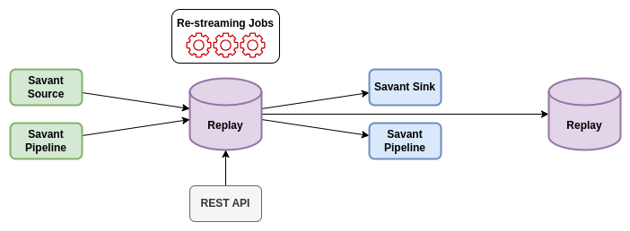

Installation And Configuration
==============================

Software Requirements
---------------------

Prebuilt Replay packages are distributed as Docker images, so regardless of the platform and OS distributive, you need to have Docker installed on your system.

If you do not want to run Replay in Docker, you can build it from source or contact us for building binaries for your platform.

Docker Images for ARM64 and X86_64 are available on GitHub Container Registry:

- `savant-replay-x86 <https://github.com/insight-platform/Replay/pkgs/container/savant-replay-x86>`_ - for X86_64 CPUs;
- `savant-replay-arm64 <https://github.com/insight-platform/Replay/pkgs/container/savant-replay-arm64>`_ - for ARM64 CPUs.

Quick Installation
------------------

To run Replay in Docker, you can use the following command:

X86_64:

.. code-block:: bash

    docker run -it --rm \
      --network host \
      -v $(pwd)/data:/opt/rocksdb \
      ghcr.io/insight-platform/savant-replay-x86:savant-latest

ARM64:

.. code-block:: bash

    docker run -it --rm \
      --network host \
      -v $(pwd)/data:/opt/rocksdb \
      ghcr.io/insight-platform/savant-replay-arm64:savant-latest

The service will use the default configuration file and store data in the ``data`` directory on the host machine.

Instead of the ``savant-latest`` tag you can use the specific version of the image, e.g. ``v0.5.10``. Refer to the `GitHub Container Registry <https://github.com/orgs/insight-platform/packages?repo_name=Replay>`_ for the list of available tags.

Environment Variables
---------------------

Only one mandatory environment variable is required to configure Replay in Docker:

- ``RUST_LOG`` - sets the log level for the service. The default value is ``info``. You can use ``debug`` or ``trace`` for more detailed logs. Also, you can change log level for a particular scope.

You can also use optional environment variables in the configuration file. Refer to the `Configuration Parameters <#configuration-parameters>`_ section for more details.

Ports
-----

Replay uses the following ports:

- ``8080`` - the port for the REST API;
- ``5555`` - the port for ingress data (Savant ZeroMQ protocol).
- ``5556`` - the port for egress data, if used (Savant ZeroMQ protocol).

If the service is deployed as a dead-end consumer, you do not need to use any other ports. Nevertheless, depending on the configuration file, you may need have an extra port opened for egress, when the service is deployed as intermediate node as depicted in the next image:

Configuration File
-------------------

The configuration file is a JSON file that contains the following parameters:

.. code-block:: json

    {
      "common": {
        "pass_metadata_only": false,
        "management_port": 8080,
        "stats_period": {
          "secs": 60,
          "nanos": 0
        },
        "job_writer_cache_max_capacity": 1000,
        "job_writer_cache_ttl": {
          "secs": 60,
          "nanos": 0
        },
        "job_eviction_ttl": {
          "secs": 60,
          "nanos": 0
        },
        "default_job_sink_options": {
          "send_timeout": {
            "secs": 1,
            "nanos": 0
          },
          "send_retries": 3,
          "receive_timeout": {
            "secs": 1,
            "nanos": 0
          },
          "receive_retries": 3,
          "send_hwm": 1000,
          "receive_hwm": 100,
          "inflight_ops": 100
        }
      },
      "in_stream": {
        "url": "router+bind:tcp://0.0.0.0:5555",
        "options": {
          "receive_timeout": {
            "secs": 1,
            "nanos": 0
          },
          "receive_hwm": 1000,
          "topic_prefix_spec": {
            "none": null
          },
          "source_cache_size": 1000,
          "inflight_ops": 100
        }
      },
      "out_stream": {
        "url": "pub+bind:tcp://0.0.0.0:5556",
        "options": {
          "send_timeout": {
          "secs": 1,
          "nanos": 0
          },
          "send_retries": 3,
          "receive_timeout": {
            "secs": 1,
            "nanos": 0
          },
          "receive_retries": 3,
          "send_hwm": 1000,
          "receive_hwm": 100,
          "inflight_ops": 100
        }
      },
      "storage": {
        "rocksdb": {
          "path": "${DB_PATH:-/tmp/rocksdb}",
          "data_expiration_ttl": {
            "secs": 60,
            "nanos": 0
          },
          "compaction_period": {
            "secs": 60,
            "nanos": 0
        }
      }
    }

The above-mentioned configuration file is used by default, when you launch Replay without specifying the configuration file. You can override the default configuration by providing your own configuration file and specifying it in the launch command:

.. code-block:: bash

    docker run -it --rm \
      --network host \
      -v $(pwd)/data:/opt/rocksdb \
      -v $(pwd)/config.json:/opt/config.json \
      ghcr.io/insight-platform/replay-x86:latest /opt/config.json

Configuration Parameters
-----------------------------

.. list-table:: Parameters
    :header-rows: 1

    * - Parameter
      - Description
      - Default
      - Example
    * - ``common.pass_metadata_only``
      - If set to ``true``, Replay will pass only metadata to the static egress stream, video content will be dropped.
      - ``false``
      - ``true``
    * - ``common.management_port``
      - The port for the REST API.
      - ``8080``
      - ``8081``
    * - ``common.stats_period``
      - The period for displaying statistics in logs.
      - ``{"secs": 60, "nanos": 0}``
      - ``{"secs": 30, "nanos": 0}``
    * - ``common.job_writer_cache_max_capacity``
      - The maximum number of cached writer sockets for dynamic jobs. When you create many jobs this feature allows reusing sockets.
      - ``1000``
      - ``500``
    * - ``common.job_writer_cache_ttl``
      - The time-to-live for cached writer sockets for dynamic jobs.
      - ``{"secs": 60, "nanos": 0}``
      - ``{"secs": 30, "nanos": 0}``
    * - ``common.job_eviction_ttl``
      - The time period completed jobs remain available in API for status requests.
      - ``{"secs": 60, "nanos": 0}``
      - ``{"secs": 30, "nanos": 0}``
    * - ``common.default_job_sink_options``
      - Default sink options to be applied to jobs if they don't specify their own options. If not set, jobs must provide their own sink options.
      - ``null``
      - See ``out_stream.options`` format.
    * - ``in_stream.url``
      - The URL for the data ingress in Savant ZMQ format.
      - ``router+bind:tcp://0.0.0.0:5555``
      - ``rep+connect:tcp://1.1.1.1:1234``
    * - ``in_stream.options``
      - The options for the ingress stream.
      - ``null``
      - ``{...}``
    * - ``in_stream.options.receive_timeout``
      - The timeout for receiving data from the ingress stream. Default value is OK for most cases.
      - ``{"secs": 1, "nanos": 0}``
      - ``{"secs": 2, "nanos": 0}``
    * - ``in_stream.options.receive_hwm``
      - The high-water mark for the ingress stream. This parameter is used to control backpressure. Please consult with 0MQ documentation for more details.
      - ``1000``
      - ``500``
    * - ``in_stream.options.topic_prefix_spec``
      - The topic prefix specification for the ingress stream. The default value is ``none``, which means that all the streams are accepted, you can also filter by source ID or source prefix to accept only specific streams.
      - ``{"none": null}``
      - ``{"source_id": "topic"}`` or ``{"prefix": "prefix"}``
    * - ``in_stream.options.source_cache_size``
      - The size of the whitelist cache used only when prefix-based filtering is in use. This parameter is used to quickly check if the source ID is in the whitelist or must be checked.
      - ``1000``
      - ``500``
    * - ``in_stream.options.inflight_ops``
      - The maximum number of inflight operations for the ingress stream. This parameter is used to allow the service to endure a high load. Default value is OK for most cases.
      - ``100``
      - ``50``
    * - ``in_stream.options.fix_ipc_permissions``
      - If set to ``true``, Replay will fix the UNIX file permissions for IPC sockets. This is useful when you run Replay in Docker with IPC sockets.
      - ``null``
      - ``777``
    * - ``out_stream``
      - The configuration for the data egress in Savant ZMQ format. This parameter can be set to ``null`` if you do not need to send data to the next node.
      - ``null``
      - ``{...}``
    * - ``out_stream.url``
      - The URL for the data egress in Savant ZMQ format.
      - ``pub+bind:tcp://0.0.0.0:5556``
      - ``null``
    * - ``out_stream.options``
      - The options for the egress stream.
      - ``null``
      - ``{...}``
    * - ``out_stream.options.send_timeout``
      - The timeout for sending data to the egress stream. Default value is OK for most cases.
      - ``{"secs": 1, "nanos": 0}``
      - ``{"secs": 2, "nanos": 0}``
    * - ``out_stream.options.send_retries``
      - The number of retries for sending data to the egress stream. Default value is OK for most cases. For unstable or busy recepients you may want to increase this value.
      - ``3``
      - ``5``
    * - ``out_stream.options.receive_timeout``
      - The timeout for receiving data from the egress stream. Default value is OK for most cases. Valid only for ``dealer`` and ``req`` socket types.
      - ``{"secs": 1, "nanos": 0}``
      - ``{"secs": 2, "nanos": 0}``
    * - ``out_stream.options.receive_retries``
      - The number of retries for receiving data from the egress stream (crucial for ``req/rep`` communication). Default value is OK for most cases. For unstable or busy senders you may want to increase this value.
      - ``3``
      - ``5``
    * - ``out_stream.options.send_hwm``
      - The high-water mark for the egress stream. This parameter is used to control backpressure. Please consult with 0MQ documentation for more details.
      - ``1000``
      - ``500``
    * - ``out_stream.options.receive_hwm``
      - The high-water mark for the egress stream. This parameter is used to control backpressure. Please consult with 0MQ documentation for more details. Change only if you are using ``req/rep`` communication.
      - ``100``
      - ``50``
    * - ``out_stream.options.inflight_ops``
      - The maximum number of inflight operations for the egress stream. This parameter is used to allow the service to endure a high load. Default value is OK for most cases.
      - ``100``
      - ``50``
    * - ``storage.rocksdb.path``
      - The path to the RocksDB storage.
      - ``${DB_PATH:-/tmp/rocksdb}``
      - ``/opt/rocksdb``
    * - ``storage.rocksdb.data_expiration_ttl``
      - The time-to-live for data in the RocksDB storage.
      - ``{"secs": 60, "nanos": 0}``
      - ``{"secs": 30, "nanos": 0}``
    * - ``storage.rocksdb.max_total_wal_size``
      - The maximum size of the write-ahead log (WAL) for the RocksDB storage.
      - ``1024 * 1024 * 1024``
      - ``2097152``

Environment Variables in Configuration File
-------------------------------------------

You can use environment variables in the configuration file. The syntax is ``${VAR_NAME:-default_value}``. If the environment variable is not set, the default value will be used.

Deployment Best Practices
-------------------------

When you deploy Replay as a terminal node, the service bottlenecks are mostly related to the underlying storage. You can use any type of communication socket like ``sub``, ``router``, ``rep`` as long as your storage keeps up with the load. The default configuration is OK for most cases.

When you deploy Replay as an intermediate node, the service can experience bottlenecks related to the downstream nodes. Thus we recommend placing a buffer adapter between Replay and the next node, if the next node can experience performance drops. Such situations may require careful maintenance and configuration modification, so using a `buffer adapter <https://docs.savant-ai.io/develop/savant_101/10_adapters.html#buffer-bridge-adapter>`_ is a failsafe option.

This is also a "must go" option when the downstream node can reload or experience network unavailability.
