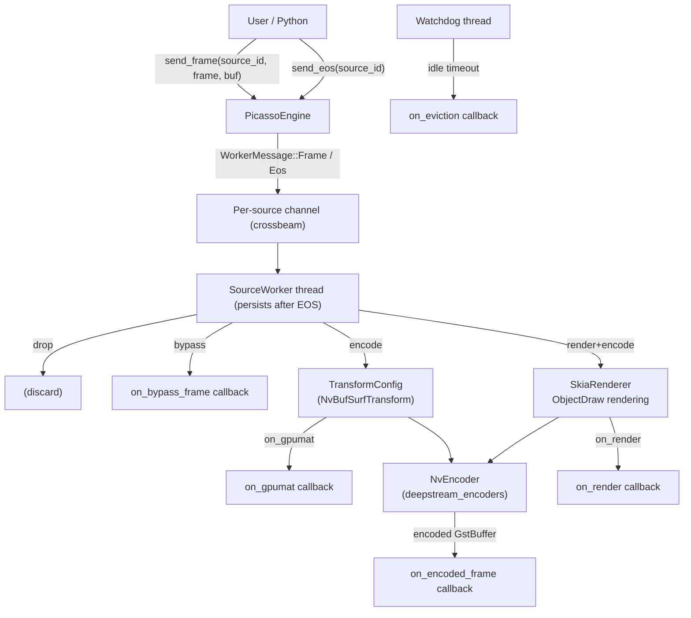

# Picasso Library Implementation Plan

## Architecture Overview



## Module Structure

```
picasso/
├── Cargo.toml                   (add all deps)
└── src/
    ├── lib.rs                   (pub use, module declarations)
    ├── error.rs                 (PicassoError)
    ├── spec.rs                  (SourceSpec, CodecSpec, ObjectDrawSpec, ConditionalSpec, GeneralSpec)
    ├── callbacks.rs             (trait + struct Callbacks holding all callbacks)
    ├── message.rs               (WorkerMessage, EncodedOutput, BypassOutput)
    ├── worker.rs                (SourceWorker: sender + JoinHandle, worker thread loop)
    ├── processor.rs             (ProcessingContext: per-frame encode/render logic)
    ├── engine.rs                (PicassoEngine)
    └── python/
        ├── mod.rs               (#[pymodule] picasso_rs)
        ├── spec.rs              (PySourceSpec, PyGeneralSpec, PyCodecSpec, PyObjectDrawSpec)
        ├── engine.rs            (PyPicassoEngine)
        └── callbacks.rs        (Python callable wrappers)
python/
├── pyproject.toml
└── picasso/
    ├── __init__.py
    ├── _native.pyi             (full PYI stubs)
    └── py.typed
```

## Key Types

### `spec.rs`

- `GeneralSpec` — default idle timeout (secs)
- `ConditionalSpec` — optional `(ns, name)` attribute for frame-level and render-level gating
- `CodecSpec` — enum: `Drop | Bypass | Encode(TransformConfig, EncoderConfig) | RenderAndEncode(TransformConfig, EncoderConfig)`
- `ObjectDrawSpec` — `HashMap<(Option<String>, Option<String>), ObjectDraw>` keyed by `(namespace, label)` wildcards
- `SourceSpec` — combines all above + `idle_timeout_secs: Option<u64>` + flags `use_on_render`, `use_on_gpumat`

### `callbacks.rs`

Traits (all `Send + Sync + 'static`):

| Trait              | Signature                                                        | When                              |
| ------------------ | ---------------------------------------------------------------- | --------------------------------- |
| `OnEncodedFrame`   | `fn call(&self, EncodedOutput)`                                  | encoded frame ready               |
| `OnBypassFrame`    | `fn call(&self, BypassOutput)`                                   | bypass mode                       |
| `OnRender`         | `fn call(&self, &str, &mut skia_safe::Canvas, &VideoFrameProxy)` | before Skia flush                 |
| `OnObjectDrawSpec` | `fn call(&self, &str, &VideoObject) -> Option<ObjectDraw>`       | per object, overrides static spec |
| `OnGpuMat`         | `fn call(&self, &str, usize, u32, u32, usize)`                   | destination buffer as CUDA ptr    |
| `OnEviction`       | `fn call(&self, &str) -> EvictionDecision`                       | source idle                       |

`struct Callbacks` holds `Option<Arc<dyn Trait>>` for each.

### `message.rs`

```rust
pub enum WorkerMessage {
    Frame(VideoFrameProxy, gst::Buffer),
    Eos,
    UpdateSpec(SourceSpec),
    Shutdown,
}

pub struct EncodedOutput {
    pub source_id: String,
    pub frame: VideoFrameProxy,
    pub buffer: Option<gst::Buffer>,  // None for the EOS sentinel
    pub pts: u64,
    pub duration: Option<u64>,
    pub is_keyframe: bool,
    pub is_eos: bool,   // true for the terminal EOS sentinel (buffer is None)
}
```

### `engine.rs`

```rust
pub struct PicassoEngine {
    workers: Arc<Mutex<HashMap<String, SourceWorker>>>,
    callbacks: Arc<Callbacks>,
    default_spec: GeneralSpec,
    watchdog: JoinHandle<()>,
}
impl PicassoEngine {
    pub fn new(general: GeneralSpec, callbacks: Callbacks) -> Self;
    pub fn set_source_spec(&self, source_id: &str, spec: SourceSpec) -> Result<()>;
    pub fn remove_source_spec(&self, source_id: &str);
    pub fn send_frame(&self, source_id: &str, frame: VideoFrameProxy, buf: gst::Buffer) -> Result<()>;
    pub fn send_eos(&self, source_id: &str) -> Result<()>;
    pub fn shutdown(&self);
}
```

`send_frame` auto-creates a `SourceWorker` if one doesn't exist (using drop-spec by default).

## Per-source Worker Thread Logic

```
loop {
  match recv_timeout(idle_timeout) {
    Frame(frame, buf) =>
      last_activity = now;
      process(frame, buf, spec, encoder, callbacks);
    Eos =>
      encoder.finish(); drain via pull_encoded_timeout(); fire on_encoded_frame(is_eos=true); encoder = None;
    UpdateSpec(new_spec) =>
      if codec/resolution changed: encoder.finish(); drain; encoder = None;
      spec = new_spec;
    Shutdown => break;
    Timeout =>
      decision = on_eviction(source_id);
      match decision { KeepFor(d) => reset timer; Terminate* => send EOS then break; }
  }
}
```

### `processor.rs` per-frame logic

- **Drop**: return immediately
- **Bypass**: transform bboxes back to initial size (see BBox Coordinate Transformations below), fire `on_bypass_frame`
- **Encode**:
  1. `encoder.generator().acquire_surface()` — get destination `NvBufSurface`
  2. `TransformConfig::do_transform(src, dst)` — GPU transform
  3. If `use_on_gpumat`: call `on_gpumat` with CUDA ptr from `acquire_surface_with_ptr`
  4. Transform bboxes from current to target size (see BBox Coordinate Transformations below)
  5. `encoder.submit_frame(dst_buf, pts, duration)`
  6. `encoder.pull_encoded()` in a loop → fire `on_encoded_frame` per result
- **RenderAndEncode**:
  1. `TransformConfig::do_transform` → intermediate buffer
  2. `SkiaRenderer::from_nvbuf(intermediate)` — load onto OpenGL canvas
  3. Iterate `frame.get_objects()`:
     - Lookup `ObjectDraw` in spec or call `on_object_draw_spec`
     - Draw bounding box / label / dot on `canvas()`
  4. `on_render(source_id, canvas, frame)` — user custom drawing
  5. `SkiaRenderer::render_to_nvbuf(dst_buf)` — flush to destination
  6. Transform bboxes from current to target size (same as Encode step 4)
  7. Proceed as Encode step 3, 5–6

## BBox Coordinate Transformations

### Background

`VideoFrame.transformations` is a `Vec<VideoFrameTransformation>` that records what happened to the pixel data:

```
InitialSize(1920, 1080)  → Scale(640, 480) → Padding(10, 10, 10, 10)
```

Object bboxes (`RBBox`) are always in the **current** coordinate space (i.e. after all recorded transformations). Picasso must adjust them when the output resolution differs from the current one.

### Affine model

All transformations are 2D axis-aligned affine: `(x, y) → (sx*x + tx, sy*y + ty)`. Each `VideoFrameTransformation` maps to:

| Transformation | Effect on affine `(sx, sy, tx, ty)` |
|---|---|
| `InitialSize(W, H)` | Sets the initial frame of reference. `sx=1, sy=1, tx=0, ty=0` |
| `Scale(W_new, H_new)` | `sx *= W_new/W_prev`, `sy *= H_new/H_prev`, `tx *= W_new/W_prev`, `ty *= H_new/H_prev` |
| `Padding(l, t, r, b)` | `tx += l`, `ty += t` (frame size grows by l+r, t+b) |
| `ResultingSize(W, H)` | **Needs verification in Savant repo** — likely informational/redundant; treated as no-op for now. TODO: confirm usage. |

Walking the chain forward from `InitialSize` produces a compound affine `A = (sx, sy, tx, ty)` mapping **initial → current**.

### Optimal single-pass procedure

Instead of applying a sequence of `Scale`/`Shift` operations to each bbox (which accumulates floating-point error), we compute one compound affine and apply it **once** per object via `RBBox::scale(sx, sy)` + `RBBox::shift(tx, ty)`.

A helper in `processor.rs` (or a dedicated `src/geometry.rs`):

```rust
struct Affine2D { sx: f32, sy: f32, tx: f32, ty: f32 }

impl Affine2D {
    fn from_transformations(chain: &[VideoFrameTransformation]) -> Self { ... }
    fn inverse(&self) -> Self {
        Affine2D { sx: 1.0/self.sx, sy: 1.0/self.sy,
                   tx: -self.tx/self.sx, ty: -self.ty/self.sy }
    }
    fn then_scale_to(&self, target_w: f32, target_h: f32,
                     initial_w: f32, initial_h: f32) -> Self { ... }
    fn apply(&self, frame: &VideoFrameProxy) {
        // single scale + single shift on each object's detection_box and track_box
        frame.transform_geometry(&vec![
            VideoObjectBBoxTransformation::Scale(self.sx, self.sy),
            VideoObjectBBoxTransformation::Shift(self.tx, self.ty),
        ]);
    }
}
```

### Bypass mode (current → initial)

1. Compute `A = Affine2D::from_transformations(frame.get_transformations())` (initial → current).
2. Compute `A_inv = A.inverse()` (current → initial).
3. `A_inv.apply(frame)` — one `Scale` + one `Shift` for all objects.
4. `frame.clear_transformations()`.
5. `frame.add_transformation(InitialSize(W0, H0))` — from the chain's first entry.

### Encode / RenderAndEncode mode (current → target)

1. Compute `A = Affine2D::from_transformations(frame.get_transformations())`.
2. Compute `A_inv = A.inverse()` (current → initial).
3. Compose with target scale: `A_target = A_inv.then(Scale(target_w / initial_w, target_h / initial_h))`.
4. `A_target.apply(frame)` — one `Scale` + one `Shift` for all objects.
5. `frame.clear_transformations()`.
6. `frame.add_transformation(InitialSize(target_w, target_h))`.

This resets the transformation chain to a clean state — downstream code sees a frame at `target_w x target_h` with bboxes already in that coordinate space.

## Conditional Processing

Before entering the pipeline, check `ConditionalSpec::frame_attribute`: if set and `frame.get_attribute(ns, name)` returns `None`, skip to drop. For render step, check `ConditionalSpec::render_attribute` similarly to skip Skia but still encode.

## EOS Handling

`send_eos(source_id)` sends `WorkerMessage::Eos` to the source's worker channel.

**Worker EOS sequence:**

1. Any frames already in the channel queue are processed first (channel is ordered FIFO).
2. `encoder.finish()` is called — sends EOS into the GStreamer pipeline.
3. Worker drains remaining encoded frames via `pull_encoded_timeout()` loop, firing `on_encoded_frame` for each.
4. A terminal `EncodedOutput { buffer: None, is_eos: true }` is fired to signal end-of-stream to the user.
5. `encoder` is set to `None`.
6. **The `SourceWorker` thread stays alive** — it does not exit. The next incoming `Frame` will recreate the encoder transparently (as specified in PLAN.md: "Next Frame will cause Encoder recreation").

`EncodedOutput::buffer` is therefore `Option<gst::Buffer>` — `None` only for the EOS sentinel.

**Bypass mode on EOS:** since there is no encoder, the terminal EOS sentinel is fired immediately without draining.

**EOS in Python:** `PyPicassoEngine.send_eos(source_id: str)` — same semantics; the `on_encoded_frame` callback receives an output object where `is_eos=True` and `buffer=None`.

## Encoder Lifecycle

- `encoder: Option<NvEncoder>` in worker state
- Created lazily on first frame needing Encode/RenderAndEncode
- Drained and set to `None` on: EOS, UpdateSpec with codec change, Shutdown
- After EOS the worker stays alive; next Frame recreates the encoder
- Creation failures are logged; frame is dropped gracefully

## Cargo.toml Dependencies to Add

- `savant_core` (workspace path)
- `deepstream_encoders` (workspace path)
- `deepstream_nvbufsurface` (workspace path)
- `gstreamer = { workspace = true }`
- `skia-safe = { workspace = true }`
- `pyo3 = { workspace = true, optional = true, features = ["extension-module"] }`
- `crossbeam-channel` (workspace)
- `parking_lot` (workspace)
- `anyhow`, `thiserror` (workspace)

## Python Package

- Mirrors pattern of `deepstream_encoders/python/`: `pyproject.toml` + `picasso/_native.pyi`
- `PyPicassoEngine.send_frame` takes `(source_id: str, frame: VideoFrameProxy, buffer: int)` where `buffer` is a GstBuffer pointer (usize) matching the existing Python convention
- All callbacks accept `Callable` objects; Python GIL is released for GPU work, re-acquired before calling Python callables
- Full `.pyi` stubs generated manually matching all Rust-side `#[pymethods]`

## Testing Plan

- **Rust unit tests** in `worker.rs` and `processor.rs` with mock callbacks
- **Integration test** in `tests/` spawning engine with a real `NvEncoder` and verifying `on_encoded_frame` is called
- **Pytests** in `pytests/` covering: frame submission, bypass mode, EOS draining, spec update, eviction callback

## Implementation Todos

1. **Check `ResultingSize` usage in Savant repo** — confirm whether it carries semantic meaning for bbox transforms or is purely informational. Adjust `Affine2D::from_transformations` accordingly.
2. Update `picasso/Cargo.toml` with all required dependencies
3. Implement `error.rs` and `spec.rs`
4. Implement `geometry.rs` (or inline in `processor.rs`): `Affine2D` with `from_transformations`, `inverse`, composition, `apply`
5. Implement `callbacks.rs`
6. Implement `message.rs` and `worker.rs`
7. Implement `processor.rs` (including bbox transform calls for bypass/encode/render+encode)
8. Implement `engine.rs`
9. Implement PyO3 bindings in `src/python/`
10. Create `python/picasso/` package with `__init__.py`, `_native.pyi`, `py.typed`, `pyproject.toml`
11. Write Rust unit tests (especially for `Affine2D` round-trip accuracy), integration tests, and pytests
12. Run `rustfmt`, `clippy`, add doc comments, fix warnings
